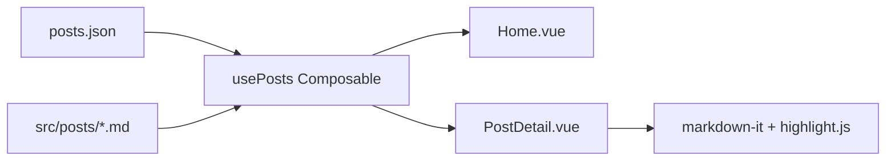

# 搭建我的首个 AI 自动化博客

在 AI 辅助开发的时代，个人技术品牌的构建速度被大幅压缩。本文记录我如何使用 Cursor + Vue 3 生态，在数小时内完成一个现代化极客风格博客的完整搭建。

## 架构设计



> **设计哲学**：索引与内容分离。`posts.json` 负责元数据，`*.md` 负责正文，Composable 负责粘合。

## 技术栈一览

| 层级 | 技术 | 职责 |
|------|------|------|
| 框架 | Vue 3 + TypeScript | 响应式 UI |
| 构建 | Vite 8 | 极速 HMR |
| 样式 | Tailwind CSS 4 | 原子化极客风 |
| 渲染 | markdown-it | MD → HTML |
| 高亮 | highlight.js | GitHub 风格代码块 |

## AI Agent 工作流

利用 AI 自动化工具，可以将重复性工程任务流水线化：

```javascript
// 伪代码：AI 辅助博客发布流水线
async function publishPost(draft) {
  const meta = await ai.extractMetadata(draft)
  const optimized = await ai.optimizeMarkdown(draft)
  await fs.writeFile(`src/posts/${meta.slug}.md`, optimized)
  await updatePostsIndex(meta)
  await git.commit(`feat: publish ${meta.title}`)
}
```

## 关键实现：动态 Markdown 加载

Vite 的 `import.meta.glob` 让我们在构建时自动索引所有文章文件：

```typescript
const markdownModules = import.meta.glob<string>('../posts/*.md', {
  query: '?raw',
  import: 'default',
})
```

这种方式无需手动维护文件列表，新增 `.md` 文件后只需更新 `posts.json` 索引即可。

## 下一步计划

1. 集成 **Giscus** 评论系统（基于 GitHub Discussions）
2. 添加 RSS 订阅与 SEO 优化
3. 接入 CI/CD 自动部署到 GitHub Pages

---

*Built with AI, powered by curiosity.*
